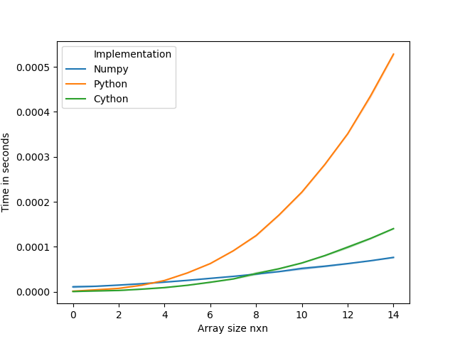

- [Introduction](#org867440f)
  - [Setup](#org0b50938)
- [Matrix multiplication](#org941cc3a)
  - [Numpy](#org1ff71a1)
  - [Python](#org45c27a1)
  - [Cython](#org5f24a66)
    - [Setup](#org87824d0)
    - [Function](#org7743585)
    - [Compile](#orgee9669a)
    - [Visualize profile](#orgc763b74)
  - [Test](#org4ce5413)
- [Results](#orge156641)
  - [Visualize](#org32a43ef)
  - [Finaly](#org0300666)
- [Reference](#org12d3159)


<a id="org867440f"></a>

# Introduction

-   Trying to understand the key principles behind matrix multiplication with different programming language
-   How it can be leveraged for algorithums that relies heavily on it (aka neural networks).


<a id="org0b50938"></a>

## Setup

```sh
python -m venv env
source env/bin/activate
pip install numpy seaborn pandas cython
```


<a id="org941cc3a"></a>

# Matrix multiplication


<a id="org1ff71a1"></a>

## Numpy

This is the reference function against which other menthods are to be compared.

```python
def np_matmul(X, Y):
    from numpy import matmul
    return matmul(X, Y)
```


<a id="org45c27a1"></a>

## Python

The pythonic way (List comprehension)

```python
def py_lc(X, Y):
    return [[sum(a*b for a,b in zip(X_row,Y_col)) for Y_col in zip(*Y)] for X_row in X]
```


<a id="org5f24a66"></a>

## Cython


<a id="org87824d0"></a>

### Setup

```python
from distutils.core import setup
from Cython.Build  import cythonize

setup(ext_modules=cythonize("cpy_mul.pyx"))
```


<a id="org7743585"></a>

### Function

```python
cpdef list cpy_mul(list X, list Y):
    cdef int x
    cdef int y
    cdef list X_row
    cdef tuple Y_col
    cdef int total
    cdef list result = []
    for X_row in X:
        result.append([])
        for Y_col in zip(*Y):
            total = 0
            for x, y in zip(X_row,Y_col):
                total += x * y
            result[-1].append(total)
    return result
```


<a id="orgee9669a"></a>

### Compile

```sh
python setup.py build_ext --inplace 
```

    Compiling cpy_mul.pyx because it changed.
    [1/1] Cythonizing cpy_mul.pyx
    running build_ext
    building 'cpy_mul' extension
    gcc -pthread -Wno-unused-result -Wsign-compare -DNDEBUG -g -fwrapv -O3 -Wall -march=x86-64 -mtune=generic -O3 -pipe -fno-plt -fno-semantic-interposition -march=x86-64 -mtune=generic -O3 -pipe -fno-plt -march=x86-64 -mtune=generic -O3 -pipe -fno-plt -fPIC -I/home/maddy/org/matrix-mul-py/env/include -I/usr/include/python3.8 -c cpy_mul.c -o build/temp.linux-x86_64-3.8/cpy_mul.o
    gcc -pthread -shared -Wl,-O1,--sort-common,--as-needed,-z,relro,-z,now -fno-semantic-interposition -Wl,-O1,--sort-common,--as-needed,-z,relro,-z,now build/temp.linux-x86_64-3.8/cpy_mul.o -L/usr/lib -o /home/maddy/org/matrix-mul-py/cpy_mul.cpython-38-x86_64-linux-gnu.so
    running build_ext


<a id="orgc763b74"></a>

### Visualize profile

Up on calling this script below; Make sure to have a look at the `html` for usage statistics

```sh
cython -a cpy_mul.pyx
```


<a id="org4ce5413"></a>

## Test

-   Generate NxN random martixs as input
-   Evaluate it against all implementation
-   Check against reference implementation

```python
def generate_input(n):
    from numpy.random import randint
    X =randint(low=0,
               high=100,
               size=[n, n]).tolist()
    Y = randint(low=0,
                high=100,
                size=[n, n]).tolist()
    return (X, Y)

def test_func(func ,X, Y):
    from time import time
    start = time()
    results = func(X, Y)
    return (results, time() - start)

def status(max_size, number_of_runs, functions):
    data = []
    for n in range(max_size):
        for _ in range(number_of_runs):
            results_across_fuctions = {}
            X, Y = generate_input(n)
            for desc, func in functions.items():
                results, t = test_func(func, X, Y)
                data.append([n, t, desc])
                results_across_fuctions[desc] = results
            reference = results_across_fuctions.pop("Numpy")
            for k, v in results_across_fuctions.items():
                assert(v == reference).all(), f"oops {k} FAILED!"
    return data
```


<a id="orge156641"></a>

# Results


<a id="org32a43ef"></a>

## Visualize

```python
def visualize(data):
    import pandas as pd
    import seaborn as sns

    index = range(len(data))
    run_df = pd.DataFrame(data, index, ["Array size nxn", "Time in seconds", "Implementation"])

    ax = sns.lineplot(x="Array size nxn",
                      y="Time in seconds",
                      hue="Implementation",
                      markers=True,
                      dashes=False,
                      data=run_df)
    fig = ax.get_figure()
    fig.savefig("output.png")
```


<a id="org0300666"></a>

## Finaly

Putting all together;

```python
def np_matmul(X, Y):
    from numpy import matmul
    return matmul(X, Y)

def py_lc(X, Y):
    return [[sum(a*b for a,b in zip(X_row,Y_col)) for Y_col in zip(*Y)] for X_row in X]

def generate_input(n):
    from numpy.random import randint
    X =randint(low=0,
               high=100,
               size=[n, n]).tolist()
    Y = randint(low=0,
                high=100,
                size=[n, n]).tolist()
    return (X, Y)

def test_func(func ,X, Y):
    from time import time
    start = time()
    results = func(X, Y)
    return (results, time() - start)

def status(max_size, number_of_runs, functions):
    data = []
    for n in range(max_size):
        for _ in range(number_of_runs):
            results_across_fuctions = {}
            X, Y = generate_input(n)
            for desc, func in functions.items():
                results, t = test_func(func, X, Y)
                data.append([n, t, desc])
                results_across_fuctions[desc] = results
            reference = results_across_fuctions.pop("Numpy")
            for k, v in results_across_fuctions.items():
                assert(v == reference).all(), f"oops {k} FAILED!"
    return data

def visualize(data):
    import pandas as pd
    import seaborn as sns

    index = range(len(data))
    run_df = pd.DataFrame(data, index, ["Array size nxn", "Time in seconds", "Implementation"])

    ax = sns.lineplot(x="Array size nxn",
                      y="Time in seconds",
                      hue="Implementation",
                      markers=True,
                      dashes=False,
                      data=run_df)
    fig = ax.get_figure()
    fig.savefig("output.png")

from cpy_mul import cpy_mul

functions = {"Numpy": np_matmul,
             "Python": py_lc,
             "Cython": cpy_mul}

max_size, number_of_runs = 15, 5

data = status(max_size,
              number_of_runs,
              functions)
visualize(data)
```

The performance of Cpython's implementation is comparable to `numpy` ; as always there is room for improvement. 


<a id="org12d3159"></a>

# Reference

-   <https://towardsdatascience.com/under-the-hood-of-neural-network-forward-propagation-the-dreaded-matrix-multiplication-a5360b33426>
-   <https://www.geeksforgeeks.org/ml-neural-network-implementation-in-c-from-scratch/>
-   <https://youtu.be/mXuEoqK4bEc>
-   <https://realpython.com/python-vs-cpp/>
-   <https://www.youtube.com/watch?v=PQo78WNGiow>
-   <https://cython.readthedocs.io/en/latest/index.html>
-   <https://github.com/numpy/numpy/blob/e80b948dc527d41d9a1fd59b09a7c790783e1d90/numpy/core/src/multiarray/multiarraymodule.c#L2406>
